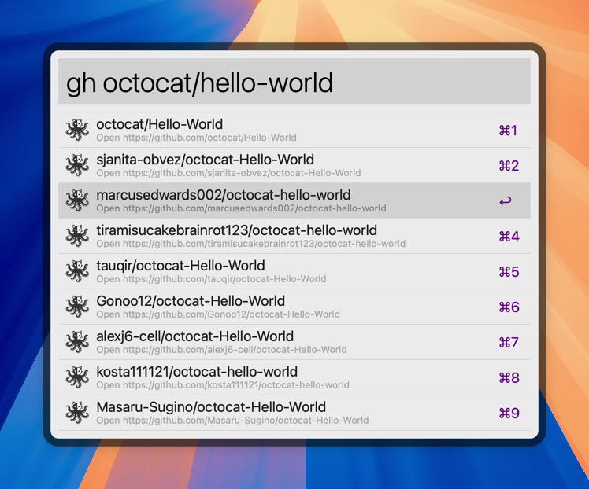

# GitHub Repos Alfred Workflow

This [Alfred](https://www.alfredapp.com/) workflow lets you search for GitHub
repositories right from the Alfred bar.

It uses the [GitHub CLI](https://github.com/cli/cli) under the hood.

## Requirements

Install the GitHub CLI:

```bash
# Run this in the terminal:
brew install gh
```

> 💡 **Note**:  
> The command above assume you use [Homebrew](https://brew.sh) as your package manager.

## Authentication

Authentication is handled by the GitHub CLI, so just follow the instructions when running:

```bash
# Run this in the terminal:
gh auth login
```

## Installation

You can download the workflow from the [releases page](https://github.com/edgarjs/github-repos-alfred-workflow/releases)
or from [Packal](https://www.packal.org/workflow/github-repos).

Double click on the `.alfredworkflow` file and follow the instructions.

## Usage

There's a single keyword that triggers the workflow: `gh`

Then you can start typing the name of the repository you're looking for.
It will first try to search within your user's repositories. And if no result
is found, then it'll search in all public repositories.

```
gh octocat/hello-world
```



When an item is highlighted, you can press Enter to open the repository's page,
or press any of the following modifiers keys for other options:

### Hold `Ctrl ⌃` for repository actions page

Press Enter while holding down the `Ctrl` key to open the repository's actions page.

### Hold `Cmd ⌘` to see Pull Requests

Press Enter while holding down the `Cmd` key to list the repository's open PR's.

### `Option ⌥` modifier

Press Enter while holding down the `Option` key to copy the clone command with the repository's SSH URL.

### `Shift+Option ⇧+⌥` modifier

Press Enter while holding down the `Shift+Option` keys to copy the clone command with the repository's clone URL.

## Configuration

### API Response Caching

You can configure the cache duration passed to the GitHub CLI, by setting the following environment variables.

| Environment Variable | Description                              | Default           |
| -------------------- | ---------------------------------------- | ----------------- |
| `CACHE_PULLS`        | Cache duration for PR's API call         | `10m`             |
| `CACHE_SEARCH_REPOS` | Cache duration for repos search API call | `24h`             |
| `CACHE_USER_REPOS`   | Cache duration for user repos API call   | `72h`             |
| `CACHE_DIR`          | Cache directory for the the `gh` CLI     | `$HOME/.cache/gh` |

> ⚠️ **Caution** ⚠️
>
> If you don't see your recently created repository in the results, it may be the cache duration mentioned above.
>
> Also make sure to use absolute paths if you need to customize the default.
> Like `/Users/juan/cache` instead `$HOME/cache`

To clear the cache and force a new request to the GitHub API, type this in Alfred:

```
ghclear
```

### Enterprise Host

If you're using an Enterprise account, you can set the following environment variable to your needs:

| Environment Variable | Description                       | Default      |
| -------------------- | --------------------------------- | ------------ |
| `API_HOST`           | Hostname to use for the API calls | `github.com` |

## Contributing

You can submit your bug reports or feature requests at:
https://github.com/edgarjs/github-repos-alfred-workflow/issues

## License

This project is published under the [MIT License](LICENSE.md).
